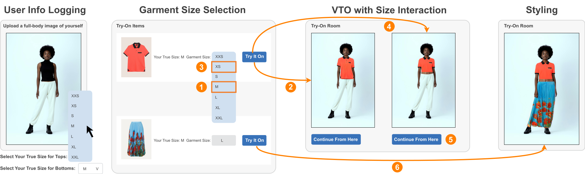

# SiCo: A Size-Controllable Virtual Try-On Approach for Informed Decision-Making



## Back-End

To setup the backend server and machine learning backbone, see [README.md](https://github.com/SherryXTChen/SiCo/blob/ml/README.md).

## Front-End

To setup our website interface:

#### Vercel Setup

Please make a Vercel site such as by following this [Vercel Guide](https://medium.com/@hikmohadetunji/hosting-your-first-website-on-vercel-a-step-by-step-guide-95061f1ca687).

#### Local Setup

```python
# clone this repo
git clone git@github.com:SherryXTChen/SiCo.git
cd SiCo

# setup vercel environment and prisma database
npm i
npx vercel link
npx vercel pull
npx vercel env pull
npx vercel env pull .env
npx prisma generate
npx prisma db pull
```

#### Running

```python
npm run dev
```
